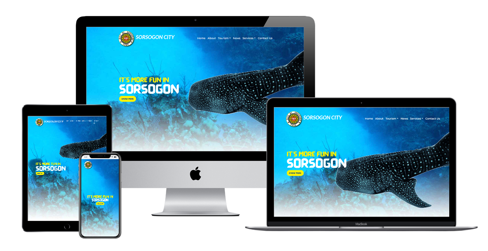

# Sorsogon City Redesign Website.

This redesign website was developed as part of my coding bootcamp at Kodigo Code Camp . This is a collaborative project and we are supposed to redesign a government website and apply our learnings in Bootstrap Framework.

## Live Link

You can see the live demo of the website here:

[(https://cjlacaste28.github.io/sorsogoncity/)](https://cjlacaste28.github.io/sorsogoncity/)

# 

## Authors

- [Christian Lacaste](https://christianlacaste.me/)
- [Jerryson Guillen](https://github.com/jerrysonguillen)

## Technologies

-   HTML
-   CSS
-   Javascript
-   Bootstrap
